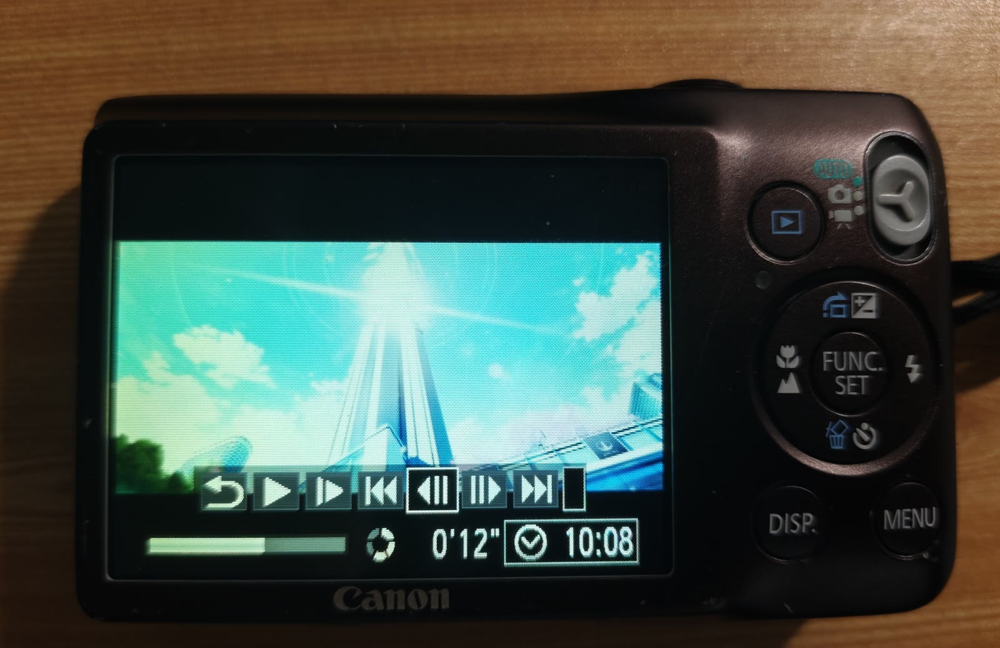
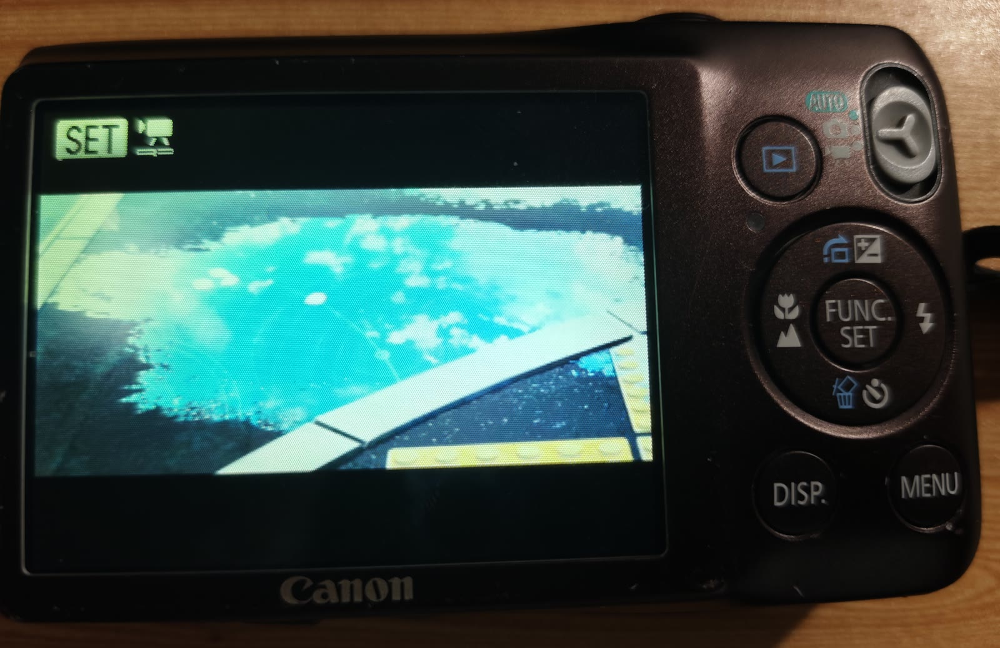

# canon_ixus105_video

[English](README.md) | 中文

把**任意视频**转成 Canon 卡片机**能在机内正常播放**的 `.AVI` + `.THM` 文件对。

由 DeepSeek V4.1 Flash 强力驱动，除了这句话以外没有任何东西是仓库作者写的👍

> **⚠️ 验证范围：全部实测只在一台 Canon IXUS 105 上完成。**
>
> `PowerShot SD1300 IS` / `IXY 200F` 是**同一台相机的其它地区名称**（相机自己的 `CanonModelID`
> 就并列写着这三个），**不是另外两台机器**。
>
> **其它 Canon 机型一概未测。** 下面的规格表是这一台相机的实测结果，别的机型很可能不同 ——
> 换机型前请先读「验证范围」一节。

普通的转码工具做不到这件事 —— 不是参数没设对，而是这台相机的固件**只认它自己录制的格式**，
并且会逐字段比对。项目里记录了把这件事试出来的全过程。

---

## 效果展示

### 真机播放

最硬的证据 —— Canon IXUS 105 正在播放转换出来的文件。时间轴停在 **0'12"（全长 20.15 秒）**，
屏幕上的画面正是那一秒的塔楼镜头：



以及开场画面，同样在相机自己屏幕上：



### 源片 vs 成品

**左：源片 ｜ 右：从成品 `.AVI` 里抽出的真实帧**（同一时刻）。画面完整保留，4:3 之外补黑边：


### 取景方式可选

源片是 13:6 的宽画面，塞进 4:3 的 640×480 必须取舍。`FITMODE` 三种模式（左 → 右）：


| 模式 | 效果 |
|---|---|
| `pad`（默认） | 完整画面 + 上下黑边，画面缩到 **27%** |
| `crop` | 放大填满、无黑边，画面 **44%**，左右各裁约 19% |
| `stretch` | 填满，但画面被拉伸变形 |

### 缩略图 = 影片第一帧

左：生成的 `.THM`（放大 4 倍以便看清）｜ 右：成品影片的第一帧。两者一致：


---

## 为什么普通转换工具不行

直接让 ffmpeg 输出 AVI，流参数全对（640×480 MJPEG + 12 kHz 单声道），相机照样报
**"不能确认的图像"**。逐项比对后发现差在这些地方：

| 项目 | 相机自己的 | ffmpeg 直出 |
|---|---|---|
| `movi` 数据块起始偏移 | **2048** | 10002 |
| `odml`/`dmlh` 块 | 有 | 无 |
| `indx` + `ix00`/`ix01` 索引 | 有 | 无 |
| 帧内 `APP0` | `AVI1` | `JFIF` |
| 帧内量化表 | 2 张 | 1 张 |
| 音频分块 | 每 30 帧一块 12012 字节 | 小碎块 |
| **色度采样** | **`Y(2,1)` `C(1,1)`，MCU 16×8** | 给不出来 |

最后一项是关键：**ffmpeg 的 MJPEG 编码器无法输出 `Y(2,1)/C(1,1)`**。而 Canon 的解码器
**根本不读 `SOF` 里的采样因子**，它硬编码了自家编码器的布局 —— 每 MCU 的块数对不上就会失步，
表现为"能播但满屏花屏"。

好在 libjpeg 的标准 4:2:2（h2v1）恰好就是这个布局，Pillow 通过 `subsampling=1` 暴露它。

## 实测兼容性（IXUS 105，样本数 = 1）

这台相机是**逐字段比对**的，不是容差判断 —— 连 30/1 fps 都不行（它和 29.97 只差 0.1%）：

| 参数 | 接受 | 试过被拒 |
|---|---|---|
| 分辨率 | **640×480** | 1280×720、2340×1080 |
| 帧率 | **30000/1001（29.97）** | 30/1、25/1、15/1、60/1 |
| 色度采样 | **`Y(2,1)/C(1,1)`** | 4:2:0、4:4:4（报 E10 并关机） |
| 缩略图厂商注释 | **必需** | 只写标准 EXIF → 拒播 |

**能自由调整的只有取景方式**（`FITMODE=pad / crop / stretch`）。

## 快速开始

```bat
:: 双击 = 转换本文件夹里所有视频
canon_convert.bat

:: 拖视频到 bat 上 = 只转这几个
:: 命令行
canon_convert.bat "D:\别的目录\片子.mp4"
```

输出写在**源视频所在目录**，同名、扩展名换成 `.AVI` 和 `.THM`。

**拷进相机卡**：两个文件都要放，位置是 `DCIM\` 下相机自己的文件夹（如 `DCIM\136CANON\`），
**不能放卡根目录** —— 相机不扫描根目录。

### 依赖

| 依赖 | 用途 |
|---|---|
| `ffmpeg` / `ffprobe` | 解码源视频、缩放，输出裸 RGB |
| **Python 3 + Pillow** | 把帧编码成 Canon 的 `Y(2,1)/C(1,1)` 采样（ffmpeg 做不到） |
| `exiftool` | 写缩略图的 EXIF |
| Windows + PowerShell | 重建 AVI 容器 |

不在 PATH 时，改 `canon_convert.bat` 开头 SETTINGS 区的 `FFMPEG` / `FFPROBE` / `EXIFTOOL` / `PYTHON`。

## 工作原理

```
源视频 ──ffmpeg──> 裸 RGB 流 ──Pillow/libjpeg──> Canon 布局的 MJPEG 帧
                                                      │
                                    _canon_finish.ps1 │ 重建容器 + 改写标记
                                                      ▼
                                              MVI_xxxx.AVI + .THM
```

1. **帧编码交给 Pillow** —— 只有 libjpeg 能给出一致的 `Y(2,1)/C(1,1)`
2. **容器从零重建** —— `movi` 落在 2048、`odml/dmlh`、两个 `strl` 各带 `indx`、
   `ix00/ix01` 子索引、每 30 帧插一块 12012 字节音频、双条目 `idx1`、`IDIT` 拍摄时间
3. **缩略图**套用真实相机 `.THM` 的厂商注释，只改写属于本片的字段

### 相机显示的录制时间

相机播放画面角上的时间**不是**标准 EXIF，它存在 **`.THM` 的一个私有字段**里 —— exiftool 既不能
作为标签读出来，也不知道它存在。

这个字段是套用供体缩略图时的一个坑：`-TagsFromFile` 会把整块厂商注释一起搬过来，
**供体录制时刻的时间也跟着来了**，相机就老老实实显示那个错误的时间。（我们自己的成品就中招了 ——
相机显示的是供体的 `10:08`，而不是源片的 `09:43`。）脚本现在会定位该字段并改写，再回读校验。

两个细节，都是拿**相机自己写出的 `.THM`** 对比出来的：

- 它紧跟在一对**重复两次的帧率特征**之后（`00 00 <num> <den>` 出现两遍）
- 存的是 **UNIX 时间戳，但把本地墙钟时间当作 UTC** —— 不是真实 UTC
- `.AVI` 里没有对应字段，时间只存在于 `.THM`

时间本身取自**源视频内嵌的 `creation_time`**，**不是**文件系统时间戳 —— 这两者经常不一样
（重新编码过的文件会保留录制日期，但不会保留下载日期）。源文件没有该字段时才退回文件时间戳，
也可以用 `DATETIME` 手工写死。

### 构建器是逐字节验证过的

用相机原片自己的帧和音频喂给这套构建器，**重建结果与相机原文件逐字节完全一致**
（11,977,496 字节，0 处差异）。这是没有真机也能拿到的最强证明。

## 文件说明

| 文件 | 说明 |
|---|---|
| `canon_convert.bat` | 一键转换脚本，所有可调参数都在开头 SETTINGS 区 |
| `_canon_frames.py` | ffmpeg 的 MJPEG 编码器做不到 `Y(2,1)/C(1,1)`，这一步绕不过去 |
| `_canon_finish.ps1` | 重建 AVI 容器、改写 JPEG 标记、写 `IDIT`、写缩略图 EXIF |
| `_canon_donor.thm` | **必需的 EXIF 供体**，提供相机校验用的 Canon 厂商注释，**别删** |
| `使用说明.md` | **完整文档**：排查全过程、参数表、常见问题 |

> `canon_convert.bat` **必须保持 CRLF 换行**。用记事本另存时不要存成 Unix/LF，
> 否则 cmd.exe 会读错脚本。

## 常见问题

**相机打不开？** 先确认分辨率 640×480、帧率 29.97、采样 `Y(2,1)/C(1,1)`，
且 `_canon_donor.thm` 在位。详见 [使用说明.md](使用说明.md) 第五、六节。

**脚本突然"拒绝访问"、连删都删不掉？** 杀软锁住了脚本。把文件夹加入信任区。
**根因通常是脚本里出现 `base64` + 解压 + 写二进制文件这类特征** —— 那是杀软眼里的释放器行为。

更多问题见 [使用说明.md](使用说明.md) 第七节。

## 验证范围

**本文档里所有"实测"结论，都只来自一台 Canon IXUS 105（2010 年的卡片机），样本数 = 1。**

| | 说明 |
|---|---|
| 测过 | Canon IXUS 105 **一台** |
| 未测 | **其它所有 Canon 机型**、其它固件版本、其它地区型号 |
| `SD1300 IS` / `IXY 200F` | 同一台相机的地区名称，**不构成额外样本** |

**为什么必须强调这点**：下面这些结论都是拿真机试出来的，而 Canon 各机型的录制规格并不统一 ——
有些机型支持 1280×720 甚至更高、有些是 25 fps（PAL 地区）、容器与 JPEG 标记布局也可能不同。

所以**换个机型不能照搬**，至少需要重新确认：

1. **分辨率与帧率** —— 用那台相机自己录一段，看它到底输出什么规格
2. **帧内采样因子** —— 逐项比对 `SOF`，本项目最难的坑就在这里
3. **容器结构** —— `movi` 偏移、`odml`、`indx`、交错规律
4. **缩略图厂商注释** —— 把 `REFTHM` 指向那台相机自己拍的 `.THM`

前三条在 [`_canon_finish.ps1`](_canon_finish.ps1) 里都有对应的校验，第 4 条改一个设置即可。

## 声明

本项目与 Canon 无任何关联，未使用其任何代码或文档。

格式信息全部来自**分析自己拍摄的文件**：Canon 的 AVI/THM 是公开的 RIFF/JPEG 结构，
MJPEG 是开放标准。项目不涉及任何加密或 DRM 绕过。

## 作者声明

**本项目全部代码由 AI 编写：[DeepSeek V4.1 Flash]。**

需求、设计取舍与**全部真机验证**由项目所有者完成 —— 相机到底能不能播，只能拿真机一次次试出来，
这部分无法由 AI 代劳。

> 披露 AI 的参与程度是负责任的做法，也便于使用者判断代码的来源与维护方式。

## 许可

[MIT](LICENSE)
